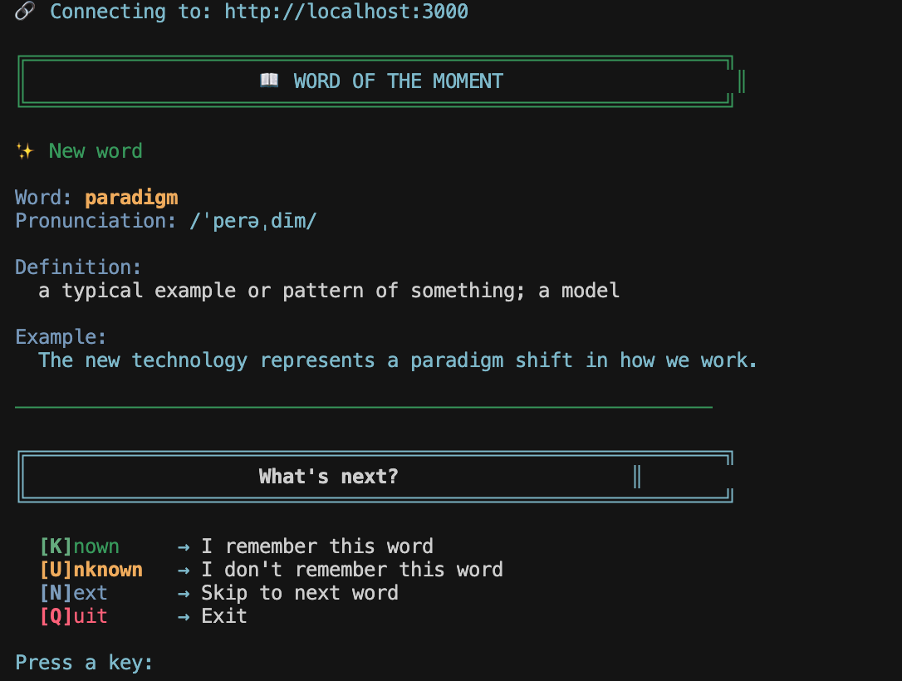

# Words Memory Service

A service to help you memorize English words during office time. Get random English words with definitions and examples via a simple API.

## Features

- **Spaced Repetition Algorithm**: Based on the memory curve (Ebbinghaus forgetting curve) to optimize learning
- Get English words with pronunciations, definitions and examples
- **Smart Word Selection**: Prioritizes words due for review, then new words, then random words
- **Progress Tracking**: Tracks your learning progress for each word
- RESTful API built with Express.js
- Clean architecture following best practices
- Terminal-friendly display format
- Easy to extend with more words

## Installation

1. Install dependencies:
```bash
npm install
```

2. Copy the environment example file:
```bash
cp .env.example .env
```

3. Start the server:
```bash
npm start
```

For development with auto-reload:
```bash
npm run dev
```

## Usage

### Terminal-Friendly Access (Recommended)

**Local Development:**
```bash
./get-word.sh
```

**Deployed Service:**
```bash
# Option 1: Pass URL as argument
./get-word.sh https://your-api-domain.com

# Option 2: Use environment variable
BASE_URL=https://your-api-domain.com ./get-word.sh

# Option 3: Create a wrapper script (see DEPLOYMENT.md)
```

See [DEPLOYMENT.md](./DEPLOYMENT.md) for detailed deployment instructions.

The script provides an **interactive menu** where you can:
- Press **`K`** to mark the word as **Known** (you remembered it)
- Press **`U`** to mark the word as **Unknown** (you forgot it)
- Press **`N`** to skip to the **Next** word
- Press **`Q`** to **Quit**

The script will automatically fetch the next word after you make a selection, creating a seamless learning flow!



**Example output:**
```
╔════════════════════════════════════════════════════════════╗
║                    📖 WORD OF THE MOMENT                    ║
╚════════════════════════════════════════════════════════════╝

🔄 Review due (2 days overdue)

Word: SERENDIPITY
Pronunciation: /ˌserənˈdipitē/

Definition:
  the occurrence and development of events by chance in a happy or beneficial way

Example:
  A fortunate stroke of serendipity brought the two old friends together.

────────────────────────────────────────────────────────────

What would you like to do?
  [K]nown   - I know this word
  [U]nknown - I don't know this word
  [N]ext    - Skip to next word
  [Q]uit    - Exit

Your choice: _
```

### Marking Words as Known/Unknown

**Recommended**: Use the interactive menu in `./get-word.sh` - just press `K` or `U`!

**Alternative**: Use the helper script for command-line marking:

```bash
# Mark word as known (you remembered it)
./mark-word.sh serendipity known

# Mark word as unknown (you forgot it)
./mark-word.sh serendipity unknown
```

**Or using curl directly:**
```bash
curl -X POST http://localhost:3000/api/words/serendipity/known
curl -X POST http://localhost:3000/api/words/serendipity/unknown
```

### Learning Statistics

Check your learning progress:

```bash
curl http://localhost:3000/api/words/statistics
```

Response includes:
- Total words learned
- Words due for review
- Words learned (3+ successful reviews)
- Words in progress
- Average ease factor

### API Access

**Using curl:**
```bash
curl http://localhost:3000/api/words/random
```

**Or visit in your browser:**
```
http://localhost:3000/api/words/random
```

### Response Example (JSON)

```json
{
  "success": true,
  "data": {
    "word": "serendipity",
    "pronunciation": "/ˌserənˈdipitē/",
    "definition": "the occurrence and development of events by chance in a happy or beneficial way",
    "example": "A fortunate stroke of serendipity brought the two old friends together."
  }
}
```

## Project Structure

```
words/
├── src/
│   ├── cli/             # CLI tools for terminal access
│   ├── config/          # Configuration files
│   ├── controllers/     # Request handlers
│   ├── middleware/      # Custom middleware
│   ├── routes/          # Route definitions
│   ├── services/        # Business logic
│   │   ├── wordService.js    # Word data and retrieval
│   │   └── memoryService.js  # Spaced repetition algorithm
│   ├── app.js           # Express app setup
│   └── server.js        # Server entry point
├── data/                # Learning progress data (auto-created)
│   └── progress.json    # User's word learning progress
├── screenshots/         # Screenshots and images
│   └── screenshot.png   # Application screenshot
├── get-word.sh          # Bash script for terminal access
├── mark-word.sh         # Script to mark words as known/unknown
├── .env.example         # Environment variables example
├── .gitignore
├── package.json
└── README.md
```

## API Endpoints

- `GET /` - Welcome message and API information
- `GET /api/words/random` - Get a word (uses memory algorithm by default, add `?algorithm=false` for pure random)
- `POST /api/words/:word/known` - Mark a word as known (successfully recalled)
- `POST /api/words/:word/unknown` - Mark a word as unknown (failed to recall)
- `GET /api/words/statistics` - Get learning statistics

## Environment Variables

- `PORT` - Server port (default: 3000)
- `NODE_ENV` - Environment (development/production)

## Memory Algorithm

The service uses a **spaced repetition algorithm** based on the memory curve (Ebbinghaus forgetting curve) to optimize your learning:

### How It Works

1. **Priority System**: Words are selected based on priority:
   - **Review**: Words that are due for review (highest priority)
   - **New**: Words you haven't seen yet
   - **Random**: Other words for variety

2. **Review Intervals**: Based on the SM-2 algorithm (SuperMemo 2):
   - First review: 1 day
   - Second review: 3 days
   - Third review: 7 days
   - Then intervals increase based on ease factor (14, 30, 60, 120+ days)

3. **Ease Factor**: Adjusts based on how well you remember:
   - Correct recall increases ease factor → longer intervals
   - Incorrect recall decreases ease factor → shorter intervals

4. **Progress Tracking**: Each word tracks:
   - Number of successful reviews
   - Current interval (days until next review)
   - Ease factor
   - Last reviewed date
   - Next review date

### Best Practices

- **Mark words after reviewing**: Always mark words as known/unknown to improve the algorithm
- **Review regularly**: The algorithm will show you words at optimal times
- **Be honest**: Mark words as unknown if you're unsure - it helps the algorithm learn your actual retention

## Future Enhancements

- Add more words to the database
- Support for word categories
- Word difficulty levels
- Multiple user support
- Export/import progress

